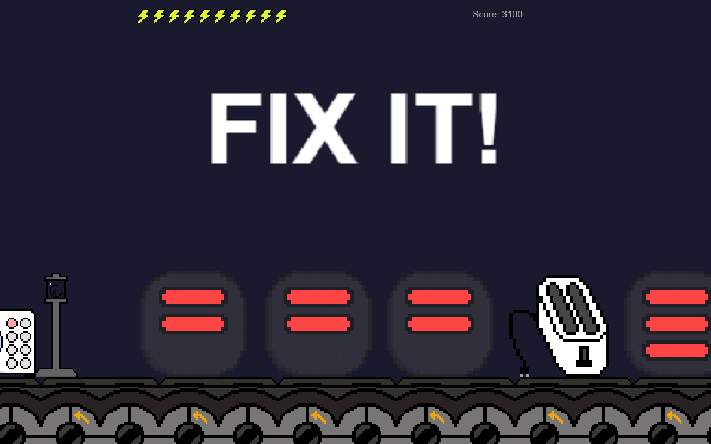

# Fix It!

**Play it:** [Wavedash](https://wavedash.com/games/fix-it) · [itch.io](https://masonlet.itch.io/fix-it)



A casual HTML5 arcade game where broken contraptions roll down a conveyor belt. Spot the faults, tap to inspect, and complete quick minigames to fix them before they slide off the edge. Start simple - pump a bike tire, screw a lightbulb - then face increasingly complex machines with multiple faults as the belt speeds up. You get 10 lives; each unfixed issue costs one.

> Originally built for the [Gamedev.js Jam 2026](https://gamedevjs.com/jam/2026/) (theme: Machines). The jam version lives at [fix-it-jam](https://github.com/masonlet/fix-it-jam); this repo is the continued development.

## Tech Stack

<p align="left">
  
  
  
  
  
</p>

## Deployment & Configuration

### Prerequisites

- [Node.js](https://nodejs.org) is required to install dependencies and run scripts via `npm`.

### 1. Clone & Install

```bash
git clone https://github.com/masonlet/fix-it.git
cd fix-it
npm install
```

### 2. Run Locally

```bash
npm run dev   # Local development server
npm run build # Production build
```

## Credits

- Project scaffolded from [phaserjs/template-youtube-playables](https://github.com/phaserjs/template-youtube-playables)
- YouTube Playables Helper Library (`YoutubePlayables.js`) by [Phaser Studio](https://phaser.io/)

## License

MIT License - see [LICENSE](./LICENSE) for details.
